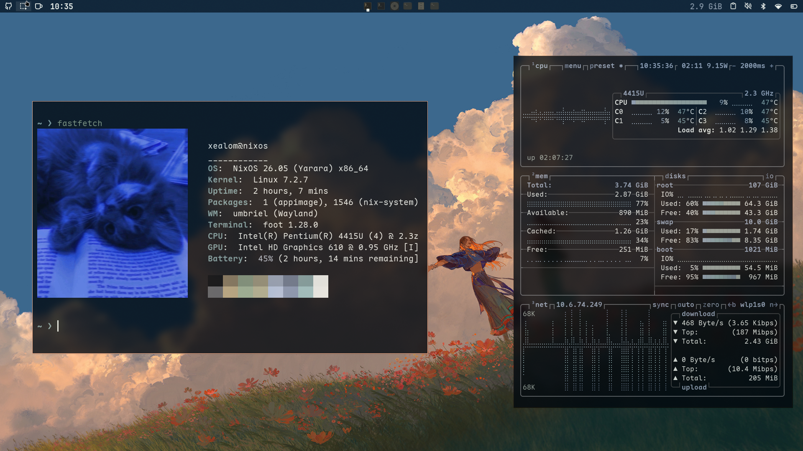
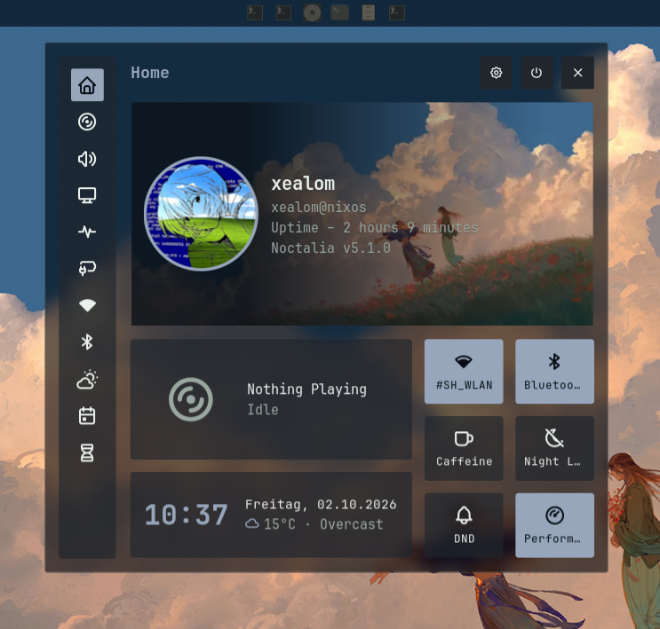

<div align="center">

# dotfiles

**NixOS + Umbriel + Noctalia — one flake, one theme source.**




</div>

## Install

```bash
git clone https://github.com/Malte-Dzierzon/dotfiles.git ~/Projects/dotfiles
cd ~/Projects/dotfiles
./scripts/install.sh --dry-run   # preview, changes nothing
./scripts/install.sh             # full install + rebuild + verify
```

Fresh machine one-liner:

```bash
curl -fsSL https://raw.githubusercontent.com/Malte-Dzierzon/dotfiles/main/scripts/bootstrap.sh | bash
```

| Flag | Effect |
| :--- | :----- |
| `--dry-run` | print every action, change nothing |
| `--no-rebuild` | symlinks only, skip `nixos-rebuild` |
| `--no-user-pkgs` | skip external binaries |
| `--verify-only` | run health check, change nothing |

The installer links `configs/dotconfig/*` to `~/.config/` (existing files backed up to `*.pre-dotfiles`), adopts the host's `hardware-configuration.nix`, runs `nh os switch`, and finishes with `scripts/verify.sh`.

## Second PC (minimal NixOS → full setup)

1. Install **minimal NixOS 26.05** (graphical installer ISO): in the installer
   select **no desktop environment**, enable **EFI/systemd-boot**, create user
   `xealom`, enable **NetworkManager**, reboot into the console.
2. As `xealom` with network: `nix-shell -p git curl` (one shell only).
3. Run: `curl -fsSL https://raw.githubusercontent.com/Malte-Dzierzon/dotfiles/main/scripts/bootstrap.sh | bash`
   (pins: replace `main` with a commit hash for reproducibility).
4. When asked, enter the sudo password (NOPASSWD for `nixos-rebuild`/`nh`
   applies only after the first switch). Reboot, log in via the
   Noctalia greeter.
5. Verify: `./scripts/verify.sh` in `~/Projects/dotfiles` (all green).

Automated: nix/flakes enablement, all `~/.config` symlinks, hardware-config
adoption, `nh os switch` (system + home-manager + packages + greeter +
Umbriel + Noctalia + themes + keybindings + services).
Manual: NixOS base install (partitions, user, network), sudo password on
first run, external binaries (`~/.local/bin/{omp,cliamp-real,zapfast-real,
pakmc-bin}` — installer warns), `~/Music` content, secrets/logins
(GitHub, Bitwarden, Wi-Fi passwords).


## Stack

| Layer | Choice |
| :---- | :----- |
| Distro | NixOS 26.05 |
| Compositor | Umbriel |
| Shell | Noctalia (bar, launcher, theming) |
| Terminal | foot (default) / kitty / alacritty / ghostty |
| Prompt | fish + starship |
| Editor | Zed (default) / Neovim |
| Browser | Zen (pinned flake input) |
| Files | Nautilus / Yazi |
| Music | mpd + mpc + rmpc, kew, cliamp |
| Launcher | walker |

<details>
<summary><b>Full app list</b></summary>

| App | Purpose |
| :-- | :------ |
| foot / kitty / alacritty / ghostty | terminals |
| walker | launcher |
| umbriel | compositor |
| noctalia (+ noctalia-greeter) | shell + login screen |
| zed-editor / neovim | editors |
| nautilus / yazi | file managers |
| zen-browser | browser (pinned flake input) |
| mpd + mpc + rmpc, kew, cliamp | music |
| sonora | music player (flake input) |
| toofan | typing test (flake input) |
| mpv, imv | media viewers |
| btop, fastfetch | monitor / info |
| qalculate-qt + libqalculate | calculator |
| wiremix, playerctl, brightnessctl | audio / brightness |
| obsidian, zettlr, readest | notes / reading |
| gh, lazygit, lazydocker | git / docker |
| bitwarden-cli | passwords |
| wireshark, nmap, iw, bluez | network / bluetooth |
| prismlauncher, steam-run, osu-lazer-bin | gaming |
| concord, flare-signal | chat |
| pi-coding-agent, nodejs, python3 | dev runtimes |
| nix-search-tv, nil, alejandra, nh, jq | nix tooling |
| wl-clipboard, grim, slurp, wlsunset, swaylock, xwayland-satellite, polkit_gnome | wayland helpers |
| eza, fzf, zoxide, bat, fd, ripgrep, tmux, starship, git, tree, unzip, zip, file, wget, psmisc, cava, gdu, ffmpeg, appimage-run, xdg-utils, file-roller, adwaita-icon-theme, yaru-theme, qt6ct, inkscape, lmstudio (buildFromSource only) | cli / utils / assets |

</details>

## Theme

Single source: Noctalia palette **Haven** (`background #070e15`, `foreground #e9efeb`, `accent #97a6bb`). Every app consumes it — umbriel, foot, GTK, Qt, yazi, zed, starship, btop, walker. Generated files are committed as a starting point; Noctalia rewrites them on theme change, which shows up as an intentional `git diff`.

## Layout

```
flake.nix               inputs (pinned in flake.lock) + nixosConfigurations.nixos
hosts/nixos/            settings.nix, default.nix (+ host hardware-configuration.nix, gitignored)
modules/nixos/          system areas (boot, nix, locale, networking, audio, greeter, user)
desktops/umbriel/       umbriel nixos.nix + home.nix
desktops/shared/        shared wayland home config
home/programs/          package list    home/shell/  fish/git/starship/mpd config
home-entry.nix          home-manager entrypoint (identity + symlinks)
configs/dotconfig/      plain app configs → ~/.config (no Nix string escaping)
home/.local/bin/        helper scripts  scripts/  install.sh, verify.sh, bootstrap.sh
```

## Notes

- **Hardware config** is host-specific: the installer copies it from `/etc/nixos/` on first run, never from the repo.
- **Live state** (`~/.local/state/noctalia/settings.toml`, wallpapers in `~/Pictures/Wallpapers/`) is not versioned — the tracked copy under `home/.local/state/noctalia/settings.toml` is the starting point.
- **External binaries** (`~/.local/bin/{omp,cliamp-real,zapfast-real,pakmc-bin}`) have no nixpkgs source; the installer warns if missing.
